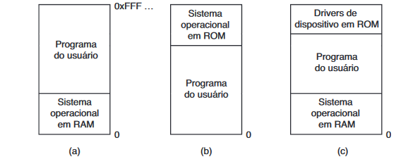
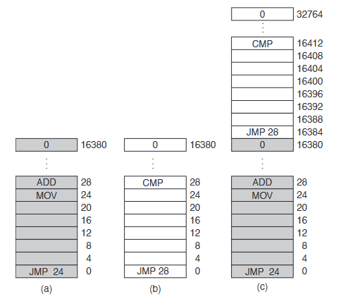
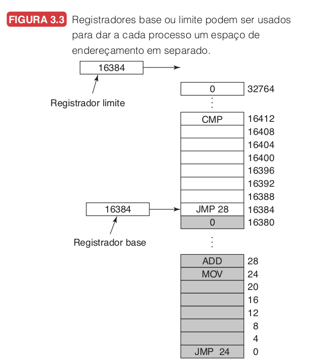
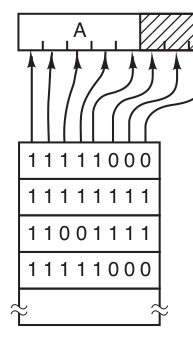
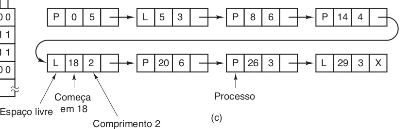
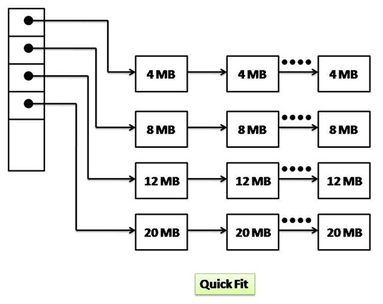

# Gerenciamento de Memória

## Abstração de Memória

Inicialmente não se existia abstração de memória, existindo apenas a memória física a qual o computador tinha acesso direto. Por esse motivo não era viável a multiprogramação (presença de inúmeros usuários, processos e terminais simultâneamente, acessando a memória e fazendo uso dos recursos do sistema operacional).
Mesmo assim era possível várias implementações do acesso à memória como pode ser visto na imagem abaixo




Figura A : Presente em computadores antigos, sistema operacional presente na memória de acesso aleatório

Figura B : Presente em sistemas embarcados e de menor porte, sistema operacional presente em memória apenas de leitura gravada em fábrica

Figura C : Presente nos primeiros computadores pessoais

Tanto os modelos A e C apresentam uma vulnerabilidade à integridade do sistema operacional por estar presente em memória RAM, sendo passível de alteração pelo usuário.

## Problema de Endereçamento - Memória Física

Um dos maiores problemas no endereçamento de memória quando o sistema faz acesso direto ao mesmo, é quando um processo aponta para um endereço a fim de realizar uma instrução neste, o sistema realiza um swapping e o novo processo carregado na memória principal (em uma posição diferente de 0) aponta para a memória física a partir do endereço 0 e não usando como base seu real endereço.



Uma forma de resolver isso é através da realocação estática, em que ao ser carregado na memória, o programa terá uma constante referente à sua posição na memória, incrementada para cada endereço apontado em suas instruções. Apesar da solução resolver o problema, ela apresenta problemas de performance ao sistema.

## Espaços de Endereçamento

Surgiu-se então os espaços de endereçamento, uma abstração em que cada processo possa alocar endereços da memória de forma que estes estejam protegidos e que a visibilidade da memória em relação aos processos, seja limitada ao escopo local deste (com exceção de cirtunstâncias as quais dois ou mais processos utilizam de memória compartilhada) 

## Registradores Base e Registradores Limite

Uma solução que foi aplicada para resolver o problema de conflito de endereçamento foi através dos registradores base e limite, os quais são usados quando um programa é carregado na memória. O registrador base é carregado com o endereço físico onde o programa começa na memória e o registrador limite carrega o comprimento do programa, para cada programa a ser carregado na memória o registrador base apresentará um valor cada vez maior, supondo que um programa será carregado em endereços posteriores aos outros.

A grande vantagem dessa implementação é que os registradores oferecem para cada processo, um espaço de endereçamento local, protegido e logicamente separado dos outros endereçamentos.

Toda vez que um processo referenciar a memória, a CPU irá adicionar o valor base ao endereço gerado para o processo antes de enviá-lo para o barramento de memória, assim como verificar se este valor é igual ou maior do que o valor do registrador limite.
Essas operações são uma desvantagem na implementação, pois tornam o sistema mais lento devido ao tempo de propagação de transporte presente na adição (carry-propagation time).

## Swapping (troca de processo)

A quantidade de processos que se encontra presente apenas para realizar funções de inicialização do sistema operacional e dos programas de usuários, é tão grande que não é possível alocar alocar todos esses processos na memória principal. Ou seja : a demanda de memória RAM é extremamente alta desde a inicialização do sistema.

Algumas estratégias foram desenvolvidas para solucionar este problema, uma delas é através do swapping, em que **um processo é carregado a partir do disco para a memória principal em sua totalidade, é executado por um tempo e então retornado ao disco, dando espaço para execução de outros.**

Outra forma de resolver esse problema é através da memória virtual, o qual os programas podem ser executados mesmo estando apenas parcialmente na memória principal.


Ao realizar o swapping do mesmo processo muitas vezes, este muito provalvelmente não será alocado ao seu endereçamento anterior, sendo assim é trabalho do hardware durante a execução, realocar os endereçamentos conforme sua posição.

## Alocação de Memória e Tamanho dos Processos

Quando um processo é alocado na memória, o sistema operacional deve trabalhar para alocar a memória que for suficiente para este, levando em consideração alguns fatores.

Caso o processo seja criado com um tamanho fixo, satisfazer essa necessidade é o que deve ser feito sem maiores conflitos. 

No entanto, caso o processo apresente a possibilidade de seus dados crescerem a memória será alocada dinâmicamente, de forma que um espaço adjacente ao processo pode ser alocado e o processo poderá crescer. 

Por outro lado, caso o espaço adjacente já pertença à outro processo, o processo de tamanho dinâmico deve ser movido para um espaço grande o suficiente na memória, se isso não for possível então o processo deve ser temporáriamente suspenso até que o espaço seja liberado, ou mesmo morto. 

Como os processos tendem a crescer e utilizar de mais memória, é uma boa ideia alocarmos um pouco mais de memória para cada processo, na intenção de reduzir a sobrecarga e fluxo na troca de processos em espaços insuficientes.

Mas para que isso seja eficar, essa memória temporária não deve ser transferida junto com os processos ao disco. Apenas a memória realmente em uso deve ser transferida para o disco

### Compactação de Memória

Durante a troca de processos, múltiplos espaços na memória são ocupados e desocupados, com uma tendência de gerar lacunas ou pequenos espaços vazios entre os endereços ocupados. É possível acumular esses pequenos espaços vazios em um grande espaço vazio, movendo os processos para uma direção (para cima ou para baixo) o máximo possível. No entanto, **o processo de compactação de memória tende a exigir muito processamento e tempo de execução da CPU**, proporcional à largura da memória principal


## Gerenciamento da Memória Livre

Ao ser designada dinâmicamente, a memória principal passa a ser gerenciada pelo Sistema Operacional. Esse gerenciamento pode ser implementado de duas formas : mapas de bits e listas encadeadas.

### Mapas de bits

Através do mapa de bits, a memória é dividida em unidades muito pequenas que são mapeadas e identificadas como ocupadas ou não (1 ou 0).

Uma informação muito importante é o tamanho de cada unidade de alocação. Quanto menor for seu tamanho maior será o mapa de bits, sendo assim podemos também afirmar que quanto maior for a unidade de alocação, menor será o tamanho do mapa de bits, no entando uma quantidade considerável de memória será perdida caso o tamanho não seja múltiplo exato da unidade de alocação.

 

Uma desvantagem é que quando for carregar um processo na memória com tamanho de *x* unidades, o gerenciador de memória irá buscar no mapa por uma sequẽncia de *x* bits 0 consecutivos, no entanto essa busca de um comprimento determinado é lenta.


### Listas Encadeadas

Outra forma de controlar o uso da memória é através de listas encadeadas que estarão guardando informações referente aquele endereçamento de memória.

Através da lista encadeadas, é possível armazenar se o endereço se encontra ocupado por um processo ou se está livre, assim como onde ele começa e o seu comprimento, sem mencionar que cada endereçamento passa a ter uma referência do próximo, mesmo ele estando livre ou ocupado 



Ao implementar uma lista encadeada para gerenciar a memória, é possível determinar critérios de ordenação. Caso os processos e espaços livres sejam ordenados por seus endereços, é possível implementar algoritmos para alocação de memória.

Para os algoritmos mencionados abaixo, leve em consideração que a MMU possui a informação de quanto de memória deve ser alocada

### First Fit (primeiro encaixe)

A MMU examina a lista de segmentos buscando por um espaço livre que seja grande o suficiente para o processo ser alocado. Após encontrado, a menos que o tamanho seja exatamente o mesmo necessário pelo processo (algo muito incomum), o espaço livre então é dividido entre 2 partes, uma que será composta pelo processo e a outra que permanecerá livre.
 
### Next Fit 

Uma pequena variação do First Fit. Invés de percorrer toda a lista, o algoritmo passa a percorrer a partir de onde havia parado anteriomente. A partir de simulações realizadas por Bays(1977), foi demonstrado que o Next Fit tem um desempenho ligeiramente pior do que o First Fit


### Best Fit 

O Best Fit faz uma busca total na lista para escolher o menor espaço livre que seja adequado para alocar o processo. Invés de selecionar o primeiro espaço livre que encontrar, é selecionado o espaço livre mais próximo do tamanho do processo, de forma que evite a ocupar grupos de espaços maiores, permitindo que esses sejam usados em situações propícias

Este algoritmo é mais lento do que o First Fit pois pra cada chamada deve percorrer a lista inteira, e surpreendentemente também é o que resulta em maior desperdício, pois passa a preencher espaços minúsculos e irrelevantes na memória

### Worst Fit

Este algoritmo busca utilizar os espaços em que se sobrarão maior espaço livre, apesar de aparentar um péssimo critério, isso favorece para que se mantenha frequente os espaços maiores na memória em que outros processos irão utilizar, diminuindo a fragmentação

### Quick Fit 

Este algoritmo diferente dos outros, implementa uma lista em cada um de seus nós as quais armazena os endereçamento referente à cada comprimento que for solicitado, de forma que se torna extremamente rápido a busca entre os espaços disponíveis para alocação



## Memória Virtual


Ex : um programa alocado no endereço 1024 realiza a instrução ```JMP 30```. 

Ao ser carregada na memória, 
